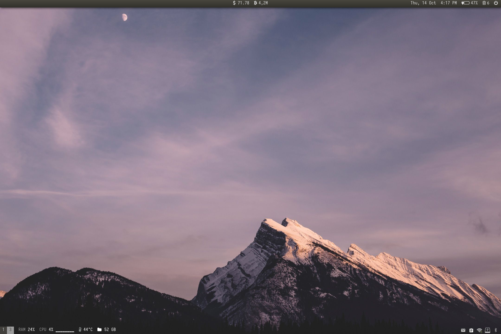

# Dotfiles :heart: Arch Linux

### polybar: config.backup

## APP AND SCRIPTS:

### home /bin dir
**`a2dissite/a2ensite`** – toggle local domain  
**`changeBacklight`** – settings backlight level  
**`changeVolume`** – settings volume level  
**`i3-terminal`** – dropdown terminal (required 'tmp' dir)  
**`iconlookup`** – for icons in terminal (lsd)  
**`live_wallpaper`** – animated wallpaper  
**`powersave/powersave_notify`** – for toggle cpu governor  
**`rebuild_cache`** – icons and fonts cache update  
**`screenshot`** – for screenshots make  
**`sendMail`** – for tests local domain mail send  
**`trashEmpty`** – clean trash  
**`view-svg`** – viewer svg files (nnn)  
**`xproper`** – for get window prop  
**`xterm`** – placebo cmd  
**`setgid_torify <app_name>`** – launch app from TOR  
**`iptables_torify`** – add rules for tor

## HOTKEYS:
<u>$mod = **win_logo**</u>  
<u>Mod1 = **Alt**</u>

### System
**`$mod+x`** – kill current window  
**`$mod+Shift+Enter`** – nnn (file manager)  
**`$mod+t`** – turbo boost toggle  
**`$mod+n`** – dolphin (file manager)  
**`$mod+,`** – gucharmap (symbols table)  
**`alt (double click)`** – espanso toggle  
**`$mod+Shift+minus`** – to scratchpad  
**`$mod+minus`** – show from scratchpad  
**`$mod+Mod1+a`** – icloud

### Multimedia
**`$mod+m`** – soundcloud  
**`$mod+Mod1+m`** – spotify  
**`$mod+Shift+m`** – play video from buffer link in mpv  
**`$mod+.`** – typora (markdown editor)

### Messengers
**`$mod+Mod1+t`** – telegram  
**`$mod+Mod+i`** – instagram  
**`$mod+Mod1+w`** – WhatsApp

